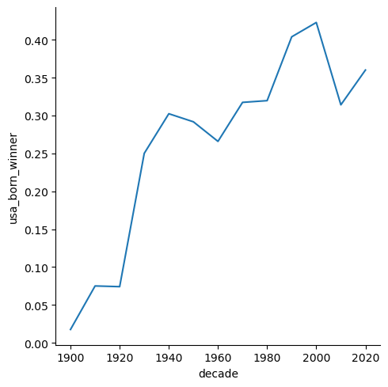
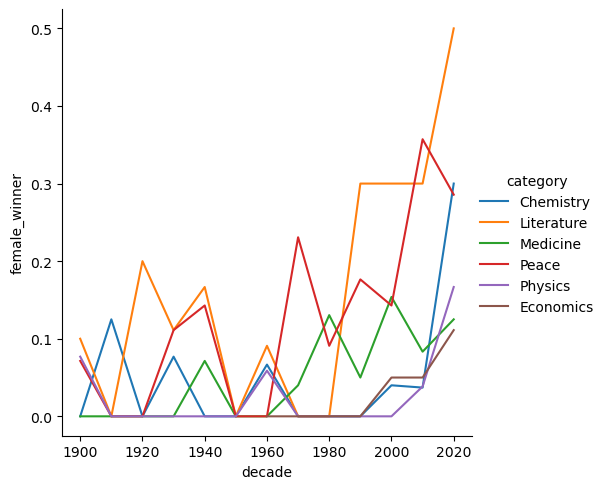

# Visualizing the History of Nobel Prize Winners

The Nobel Prize has been among the most prestigious international awards since 1901. Each year, awards are bestowed in chemistry, literature, physics, physiology or medicine, economics, and peace. In addition to the honor, prestige, and substantial prize money, the recipient also gets a gold medal with an image of Alfred Nobel (1833 - 1896), who established the prize.

<p align="center" width="100%">
    
</p>

The Nobel Foundation has made a dataset available of all prize winners from the outset of the awards from 1901 to 2023. The dataset used in this project is from the Nobel Prize API and is available in the `nobel.csv` file in the `data` folder.

## Table of Contents
- [Loading in Required Libraries](#loading-in-required-libraries)
- [Read in the Nobel Prize Data](#read-in-the-nobel-prize-data)
- [Store and Display the Most Commonly Awarded Gender and Birth Country](#store-and-display-the-most-commonly-awarded-gender-and-birth-country-in-requested-variables)
- [Calculate the Proportion of USA-Born Winners per Decade](#calculate-the-proportion-of-usa-born-winners-per-decade)
- [Identify the Decade with the Highest Proportion of US-Born Winners](#identify-the-decade-with-the-highest-proportion-of-us-born-winners)
- [Plotting USA Born Winners](#plotting-usa-born-winners)
- [Calculate the Proportion of Female Laureates per Decade](#calculating-the-proportion-of-female-laureates-per-decade)
- [Find the Decade and Category with the Highest Proportion of Female Laureates](#find-the-decade-and-category-with-the-highest-proportion-of-female-laureates)
- [Plotting Female Winners with % Winners on the Y-axis](#plotting-female-winners-with--winners-on-the-y-axis)
- [Finding the First Woman to Win a Nobel Prize](#finding-the-first-woman-to-win-a-nobel-prize)
- [Selecting the Laureates That Have Received 2 or More Prizes](#selecting-the-laureates-that-have-received-2-or-more-prizes)

## Loading in required libraries
```python
import pandas as pd
import seaborn as sns 
import numpy as np
```

## Read in the Nobel Prize data
```python
nobel = pd.read_csv('nobel.csv')
nobel
```
Output
```1000 rows x 18 columns```

## Store and display the most commonly awarded gender and birth country in requested variables
```python
top_gender = nobel['sex'].value_counts().index[0]
top_country = nobel['birth_country'].value_counts().index[0]

print("\n The gender with the most nobel laureates is :", top_gender)
print(" The most common birth country of Nobel laureates is :", top_country)
```
Output
```
 The gender with the most nobel laureates is : Male
 The most common birth country of Nobel laureates is : United States of America
```

## Calculate the proportion of USA born winners per decade
```python
nobel['usa_born_winner'] = nobel['birth_country'] == 'United States of America'
nobel['decade'] = (np.floor(nobel['year'] / 10) * 10).astype(int)
prop_usa_winners = nobel.groupby('decade', as_index=False)['usa_born_winner'].mean()
prop_usa_winners
```
Output
| decade | usa_born_winner |
|------|----------|
| 1900 | 0.017544 |
| 1910 | 0.075000 |
| 1920 | 0.074074 |
| 1930 | 0.250000 |
| 1940 | 0.302326 |
| 1950 | 0.291667 |
| 1960 | 0.265823 |
| 1970 | 0.317308 |
| 1980 | 0.319588 |
| 1990 | 0.403846 |
| 2000 | 0.422764 |
| 2010 | 0.314050 |
| 2020 | 0.360000 |

## Identify the decade with the highest proportion of US-born winners
```python
max_decade_usa = prop_usa_winners[prop_usa_winners['usa_born_winner'] == prop_usa_winners['usa_born_winner'].max()]['decade'].values[0]
max_decade_usa
```
Output
```2000```

## Plotting USA born winners
```python
ax1 = sns.relplot(x = 'decade',
                  y = 'usa_born_winner',
                  data = prop_usa_winners, 
                  kind = "line")
```
Output



## Calculating the proportion of female laureates per decade
```python
nobel['female_winner'] = nobel['sex'] == 'Female'
prop_female_winners = nobel.groupby(['decade', 'category'], as_index=False)['female_winner'].mean()
prop_female_winners
```
Output
| decade | category   | female_winner |
|--------|------------|---------------|
| 1900   | Chemistry  | 0.000000      |
| 1900   | Literature | 0.100000      |
| 1900   | Medicine   | 0.000000      |
| 1900   | Peace      | 0.071429      |
| 1900   | Physics    | 0.076923      |
| ...    | ...        | ...           |
| 2020   | Economics  | 0.111111      |
| 2020   | Literature | 0.500000      |
| 2020   | Medicine   | 0.125000      |
| 2020   | Peace      | 0.285714      |
| 2020   | Physics    | 0.166667      |

```72 rows x 3 columns```

## Find the decade and category with the highest proportion of female laureates
```python
max_female_decade_category = prop_female_winners[prop_female_winners['female_winner'] == prop_female_winners['female_winner'].max()][['decade', 'category']]
max_female_decade_category
```
Output
| decade | category |
|--------|----------|
|2020    | Literature|

## Plotting female winners with % winners on the y-axis
```python
ax2 = sns.relplot(x = 'decade', 
                  y = 'female_winner', 
                  hue = 'category', 
                  data = prop_female_winners, 
                  kind = "line")
```
Output



## Finding the first woman to win a Nobel Prize
```python
nobel_women = nobel[nobel['female_winner']]
min_row = nobel_women[nobel_women['year'] == nobel_women['year'].min()]
first_woman_name = min_row['full_name'].values[0]
first_woman_category = min_row['category'].values[0]
print(f"\n The first woman to win a Nobel Prize was {first_woman_name}, in the category of {first_woman_category}.")
```
Output
``` The first woman to win a Nobel Prize was Marie Curie, née Sklodowska, in the category of Physics.```

## Selecting the laureates that have received 2 or more prizes
```python
counts = nobel['full_name'].value_counts()
repeats = counts[counts >= 2].index
repeat_list = list(repeats)

print("\n The repeat winners are :", repeat_list)
```
Ouput
```
 The repeat winners are : Comité international de la Croix Rouge (International Committee of the Red Cross),
Linus Carl Pauling, John Bardeen, Frederick Sanger, Marie Curie, née Sklodowska,
Office of the United Nations High Commissioner for Refugees (UNHCR).
```
